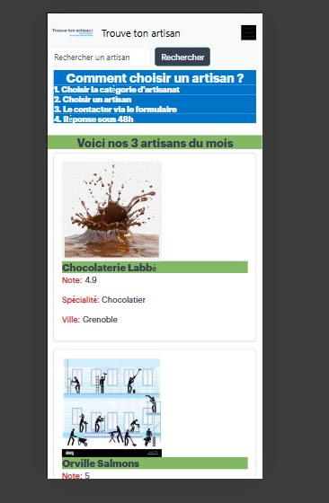
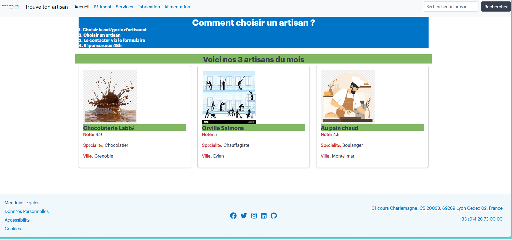
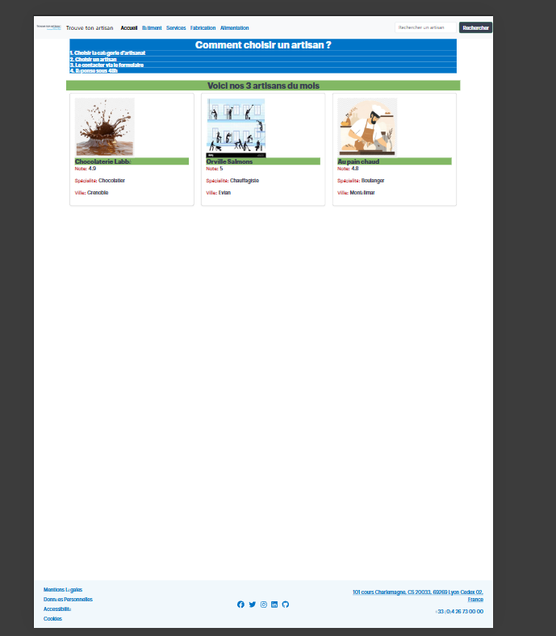
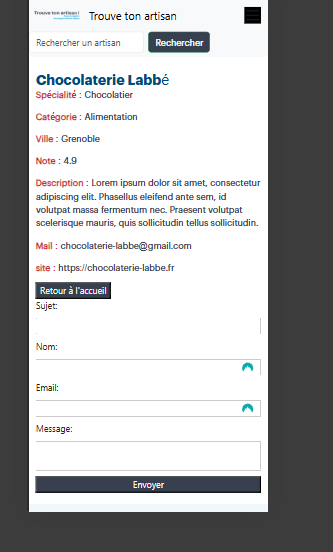
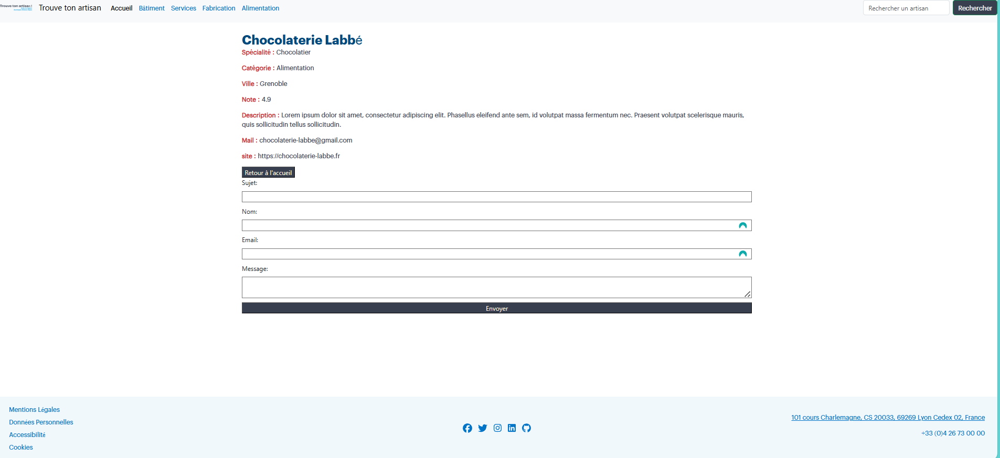
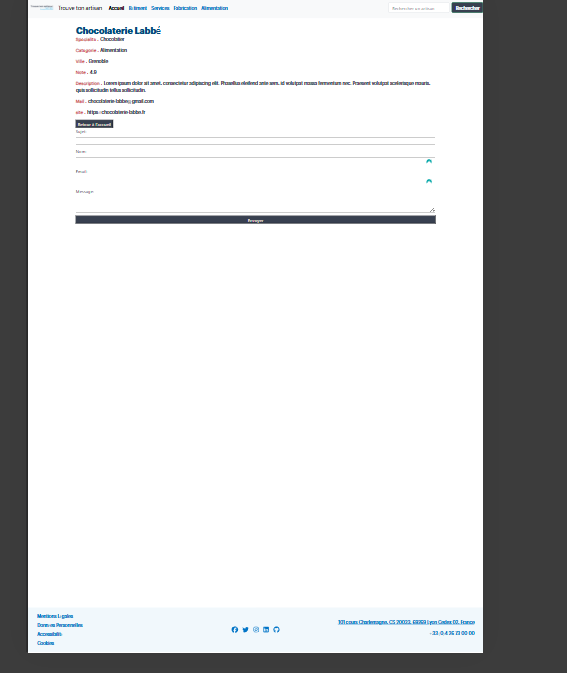
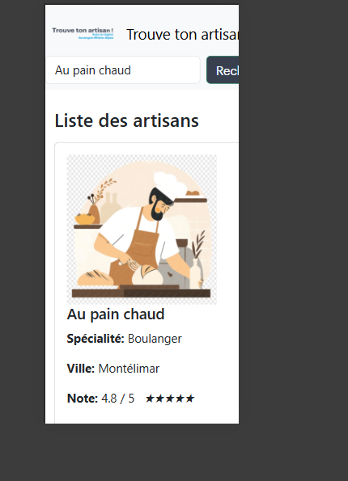
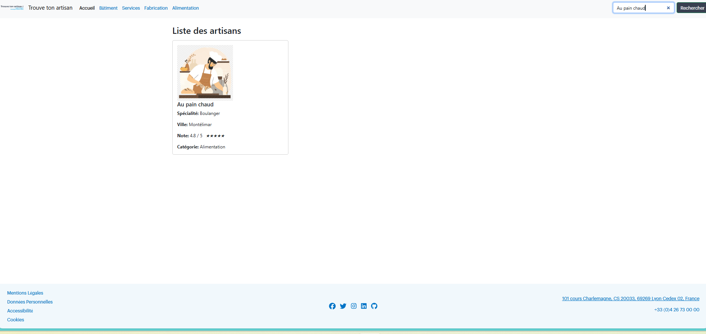
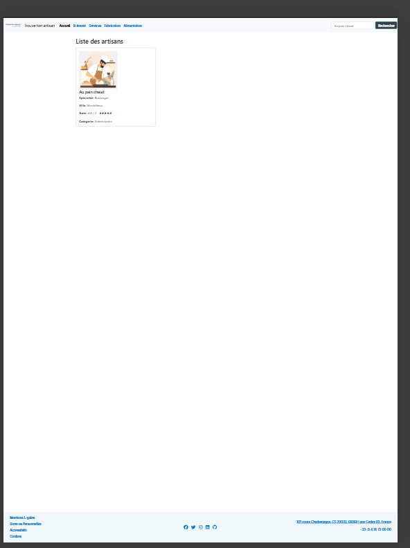

# TrouveTonArtisan 🛠️

**TrouveTonArtisan** est une plateforme web développée en Angular permettant aux particuliers de trouver et contacter des artisans qualifiés dans la région **Auvergne-Rhône-Alpes**.

---

## 📌 Objectifs

- 🎯 Aider les utilisateurs à localiser et contacter des artisans proches de chez eux.
- 🧭 Fournir une interface intuitive et responsive.
- ♿ Respecter les normes **WCAG 2.1** pour garantir l'accessibilité à tous.
- 🔌 Préparer l’intégration d’une API dans le futur.

---

## 🔧 Technologies utilisées

- Angular 19
- TypeScript
- HTML5 / Sass
- Bootstrap 5
- Figma (maquettes)
- JSON (données simulées)
- Git / GitHub

---

## 🧩 Schéma du projet

### 🔹 Création des routes

Des routes principales sont accessibles via le **header** :

- 🏗️ `/batiment` → Bâtiment  
- 🧰 `/services` → Services  
- 🪵 `/fabrication` → Fabrication  
- 🍞 `/alimentation` → Alimentation  

Et des routes secondaires visibles dans le **footer** :

- 📄 `/mentions-legales`  
- 🔐 `/donnees-personnelles`  
- ♿ `/accessibilite`  
- 🍪 `/cookie`

---

## 📁 Contenu du fichier `datas.json` et son utilité

Ce fichier contient tous les artisans avec leurs informations :  
- 🆔 `id`, 👤 `name`, 🛠️ `specialty`, 📍 `location`, ⭐ `note`, 📝 `description`

Utilisé pour :
- L’affichage dynamique des artisans
- Le filtrage par recherche
- L’accès à la fiche de chaque artisan

---

## 🚀 Lancer le projet en local

### 🛠️ Prérequis

- Node.js ≥ 18  
- Angular CLI ≥ 19.2.1

### 🔄 Étapes

```bash
git clone https://github.com/tonpseudo/TrouveTonArtisan.git
cd TrouveTonArtisan
npm install
ng serve
```

> 💡 Une fois installé, le projet est accessible sur :  
> http://localhost:4200

---

## 🔐 Sécurité (fichier `.htaccess`)

Le fichier `.htaccess` permet :

- 🔁 La redirection automatique des routes Angular vers `index.html`
- 🔒 L'ajout de headers de sécurité :
  - X-Content-Type-Options
  - X-Frame-Options
  - Content-Security-Policy
  - Referrer-Policy
  - HSTS
  - Permissions-Policy

---

## ✅ Validation W3C

Le site est conforme aux normes HTML5 selon le validateur officiel :  
🔗 [validator.w3.org](https://validator.w3.org)

> 📸 Capture d'écran disponible dans le dossier de rendu

---

## 🔗 Liens utiles

- 🌐 Démo en ligne : [https://konte.alwaysdata.net](https://konte.alwaysdata.net)
- 💻 Dépôt GitHub : [https://github.com/mystogan78/Trouver-un-artisan.git](https://github.com/mystogan78/Trouver-un-artisan.git)
- 🎨 Maquette Figma : [Voir la maquette](https://www.figma.com/design/yjAKTJOcXKVwqREARwBSoC/trouve-ton--artisan?node-id=12-109)
---

## 📸 Aperçu du projet

### 🏠 Page d'accueil





---

### 🧱 Exemple de fiche artisan détaillé





---

### 🔍 Résultat de recherche





---


